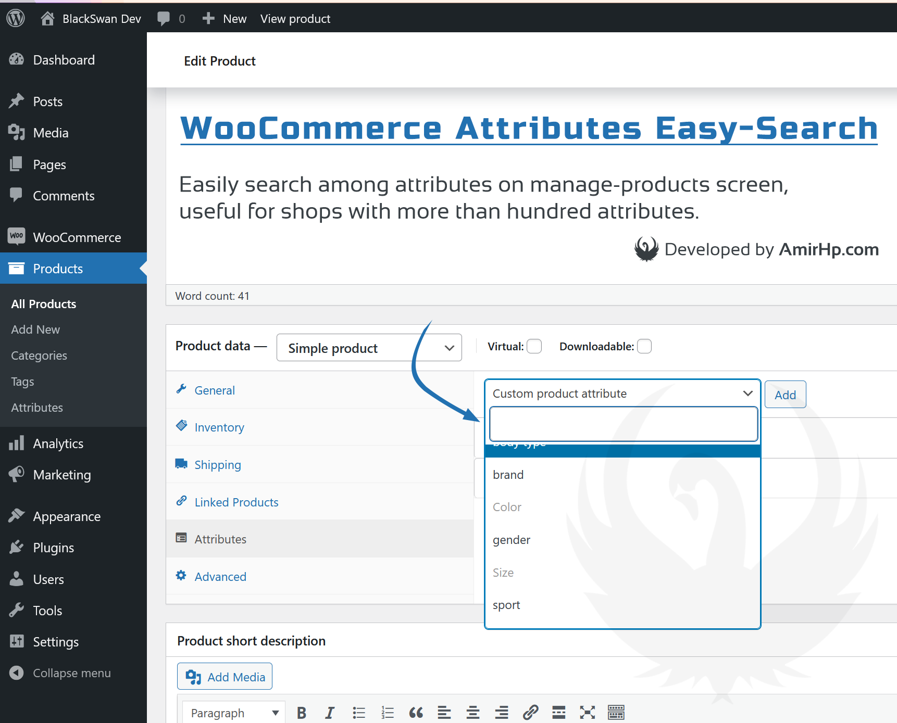

**BlackSwan Easy-Select Attributes for WooCommerce**
========================================

Developed by [AmirHp.com](https://amirhp.com/) in [BlackSwan](https://blackswanlab.ir/) / View in WordPress.org

Easily search among attributes on WooCommerce manage-products screen, useful for shops with more than hundred attributes. Just install and head to add a new product or edit an existing one, then scroll to prodcut attributes and click on attributes drop down. Tada! use search bar to find your desired attribute.

